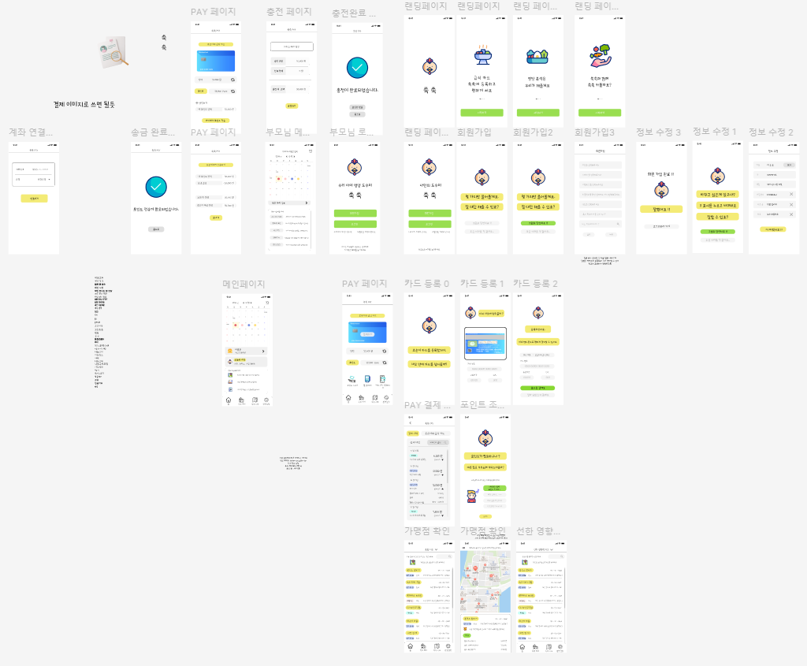
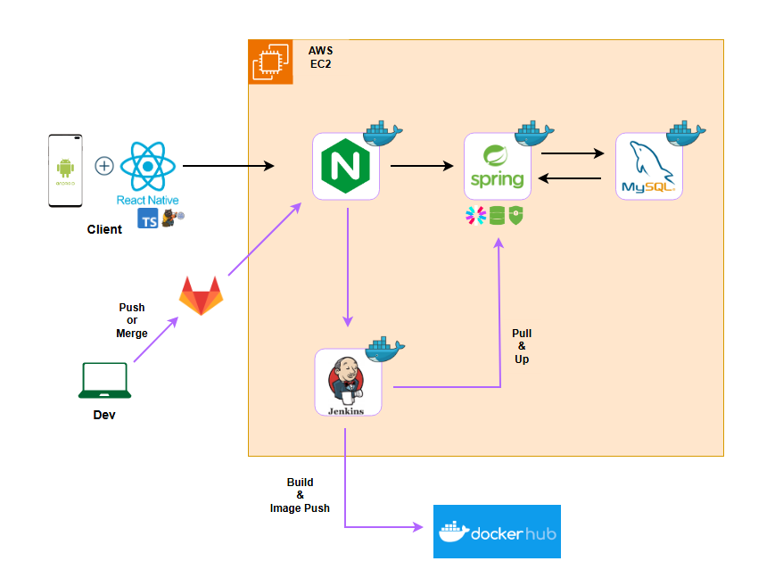
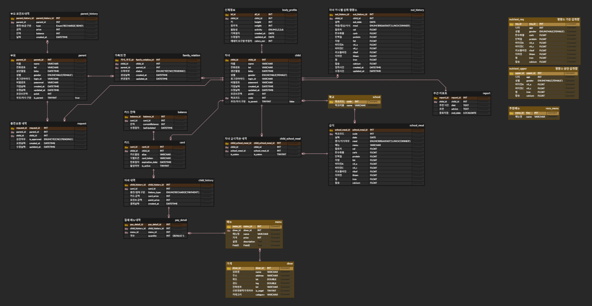
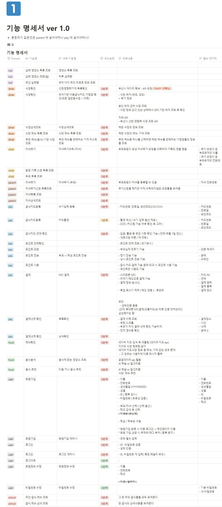
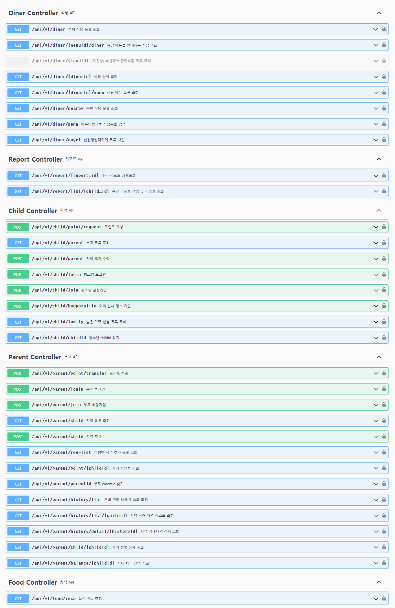
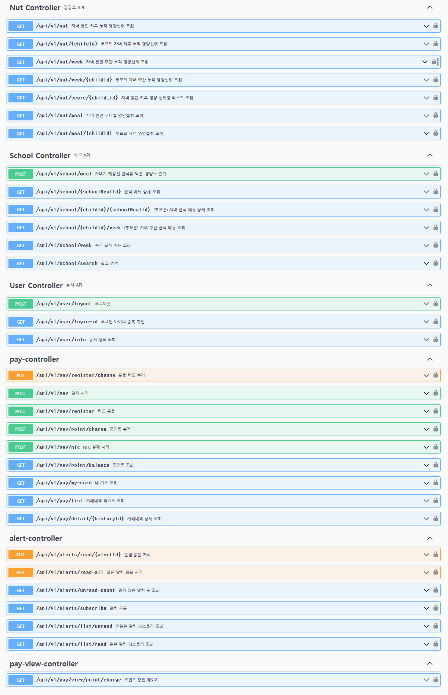

## 🥗우리아이 영양소 지킴이 쑥쑥(SSOOKSSOOK)🥗

## *"키도 쑥쑥, 자신감도 쑥쑥"*

## 목차
1. [기획 의도 및 기대 효과](#1-기획-의도-및-기대-효과)
2. [개발 환경](#2-개발-환경)
3. [주요 기능](#3-주요-기능)
4. [기술 소개](#4-기술-소개)
5. [설계 문서](#5-설계-문서)
6. [팀원 소개](#6-팀원-소개)

## 1. 기획 의도 및 기대 효과

## 2. 개발 환경
### Frontend
| Name | Version |
| --- | --- |
| Typescript | 5.0.4 |
| React | 18.3.1 |
| React Native | 0.76.1 |
| Zustand | 5.0.1 |
| NodeJs | 20.15.0 |

### Backend
| Name | Version |
| --- | --- |
| Java | 17 |
| Gradle | 8.10 |
| Spring Boot | 3.3.5 |
| JWT | 0.12.3 |
| Swagger(OpenAPI) | 2.1.0 |
| MySql | 8.0.32 |
| OpenAI | 4o |

## 3. 주요 기능
### 예시

## 4. 기술 소개

1. **예시**
    - **예시**: 예시
    - **예시**: 예시
    - **예시**: 
        - 예시
        - 예시
        - 예시
    - **API KEY**: 예시
    - **예시**: 
        - 예시
        - 예시
        - 예시
        - 예시

## 5. 설계 문서
### 와이어 프레임 Mobile

### 시스템 아키텍쳐

### ERD

### 기능명세서

### API명세서

## 6. 팀원 소개

| **[최동호]()** | **[김동건]()** | **[윤동환]()** | **[정범수]()** | **[차봉석]()** |
|:---:|:---:|:---:|:---:|:---:|:---:|
|  |  |  |  |  | 
| Backend | Backend | Frontend | Frontend | Frontend | Backend |

**Backend**
- 최동호 : 
- 김동건 : 데이터 수집(부산 전지역 가게/메뉴/급식, 영양소 관련 공문서 및 논문) 및 전처리 / 인프라 구축 / 영양소 저장 및 메뉴추천, 주간 리포트 생성 서비스 구현
- 차봉석 :

**Frontend**
- 정범수 : 
- 윤동환 : 